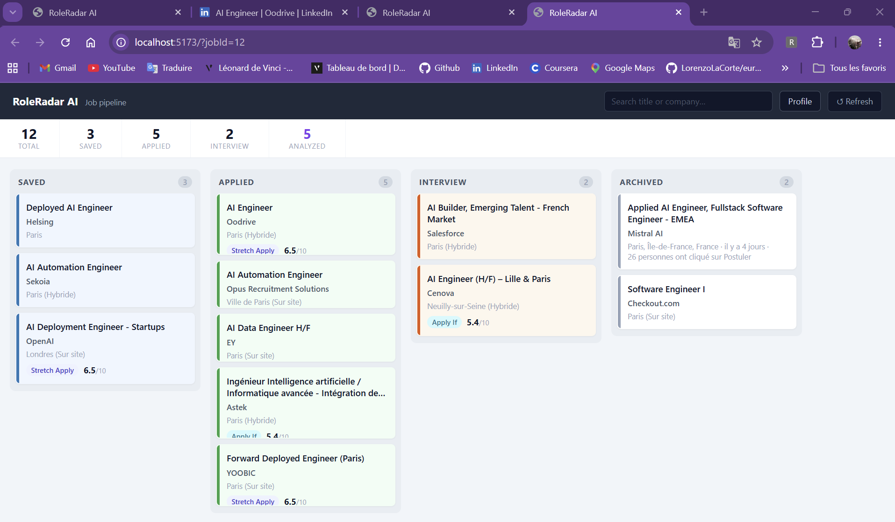
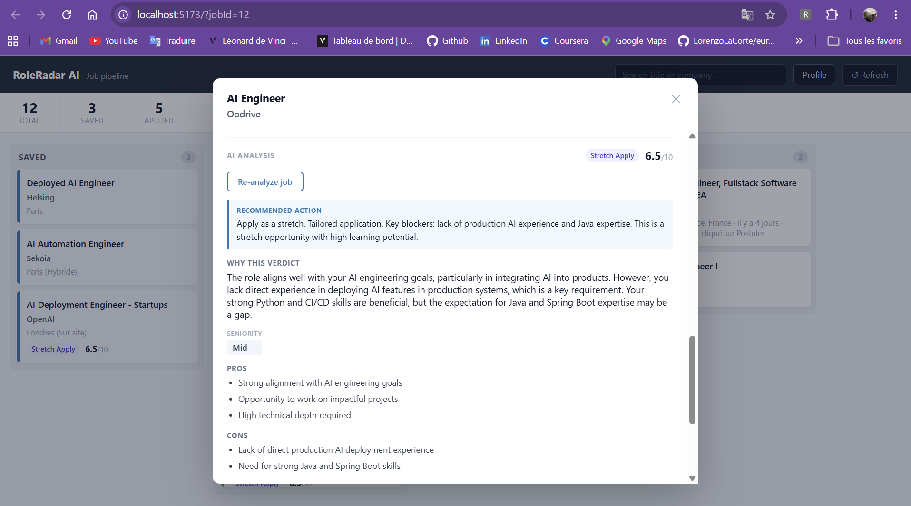
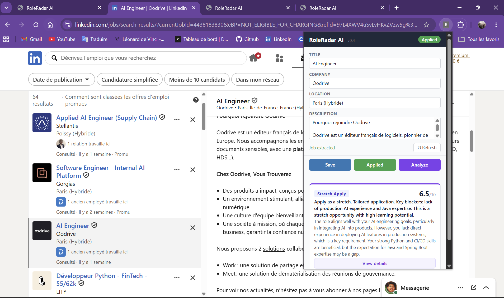

# RoleRadar AI

AI-assisted LinkedIn job tracker and role-fit analyzer.

---

## The problem

Job search gets messy fast: duplicate applications, lost context, unclear priorities. Most tools optimize for volume. This one optimizes for signal.

---

## The solution

A Chrome extension captures LinkedIn jobs in one click. A FastAPI backend stores and deduplicates them. A React dashboard tracks the pipeline. An AI analyzer evaluates each role against your profile and resume — and tells you honestly whether it's worth applying.

---
## Demo
<video src="https://github.com/user-attachments/assets/d55da337-a264-4fe7-8bdd-2daa02fa4780" controls width="100%"></video>
## Screenshots

| Dashboard | Job analysis | Chrome extension |
|-----------|-------------|-----------------|
|  |  |  |

---

## Features

- **Chrome extension** — one-click job capture from any LinkedIn job page
- **Kanban dashboard** — drag-and-drop pipeline across Saved / Applied / Interview / Archived
- **AI job brief** — extracts a clean, structured summary from raw job descriptions
- **Role-fit analysis** — scores fit across 5 dimensions: role desirability, candidate fit, conversion likelihood, career upside, opportunity cost
- **Profile editor** — target roles, salary, stack, keywords, career strategy
- **Resume upload** — parses PDF and feeds text into AI analysis context
- **Mock analyzer** — works out of the box, no API key required
- **OpenAI analyzer** — real GPT-4o-mini analysis, ~€0.0003 per job

---

## How it works

```
LinkedIn job page
  → Chrome extension (one-click capture)
  → POST /jobs (FastAPI backend)
  → SQLite (local storage, deduplication)
  → React dashboard (pipeline view)
  → POST /jobs/{id}/brief (optional: AI job brief)
  → POST /jobs/{id}/analyze (optional: AI fit analysis)
```

Analysis is always user-triggered. Nothing runs in the background.

---

## Tech stack

| Layer | Stack |
|-------|-------|
| Backend | FastAPI, SQLAlchemy, SQLite, pypdf |
| Frontend | React, TypeScript, Vite, dnd-kit |
| Extension | Chrome MV3, vanilla JS |
| AI | OpenAI gpt-4o-mini (optional), mock analyzer (default) |

---

## Local setup

**Requirements:** Python 3.10+, Node.js 18+

```bash
# Clone
git clone <your-repo-url>
cd roleradar-ai

# Python environment
python -m venv .venv
source .venv/bin/activate       # macOS/Linux
# .venv\Scripts\activate        # Windows

pip install -r requirements.txt

# Node dependencies
npm install
npm --prefix apps/dashboard install

# Environment
cp .env.example .env
```

**Start both backend and dashboard:**

```bash
# Activate venv first
source .venv/bin/activate

npm run dev
```

- API: `http://localhost:8000`
- Dashboard: `http://localhost:5173`
- Swagger UI: `http://localhost:8000/docs`

---

## Chrome extension setup

1. Open `chrome://extensions`
2. Enable **Developer mode**
3. Click **Load unpacked**
4. Select the `extension/` folder

The extension activates on `linkedin.com/jobs/*` pages.

---

## AI provider

**Default — mock analyzer (no API key needed)**

Keyword-based scoring. Works immediately. Results are clearly labelled as mock.

```
AI_PROVIDER=mock
```

**Optional — OpenAI**

```
AI_PROVIDER=openai
OPENAI_API_KEY=sk-...
OPENAI_MODEL=gpt-4o-mini
```

Note: brief generation always requires OpenAI. The mock analyzer covers fit scoring only.

---

## Ethical boundaries

- No auto-apply. No form submission on your behalf.
- No background scraping or automated browsing.
- All analysis is user-triggered, per job, on demand.
- All data stays local. Nothing is sent to external services except your explicit OpenAI calls.

---

## Project status

Local-first V1. Works end-to-end: extension → backend → dashboard → AI analysis.
Not deployed — intentionally local-first by design.

---

## Roadmap

- Smoke tests and CI
- Prompt versioning and evals
- Docker Compose for one-command setup
- Floating applied-status widget in the extension
- AI-guided profile builder

---

## What this demonstrates

- Fullstack product engineering (backend + frontend + browser extension)
- Chrome MV3 extension development with multi-strategy DOM scraping
- RESTful API design with deduplication and structured error handling
- Local-first persistence with SQLite and schema migrations
- Two-stage AI pipeline: structured extraction → context-rich analysis
- Structured LLM outputs with calibrated scoring rubrics and hard guardrails
- Product thinking: ethical boundaries, mock-first DX, honest AI scoring
