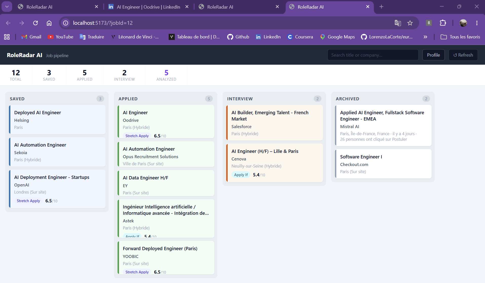
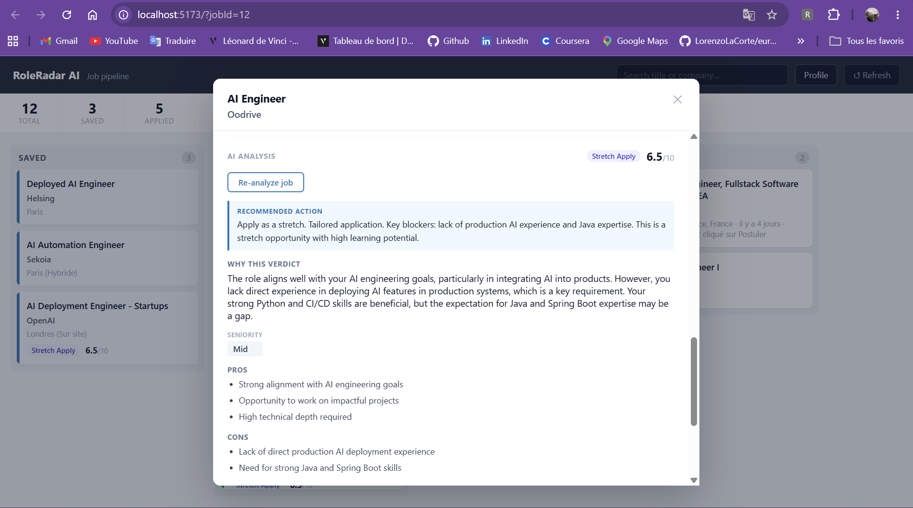
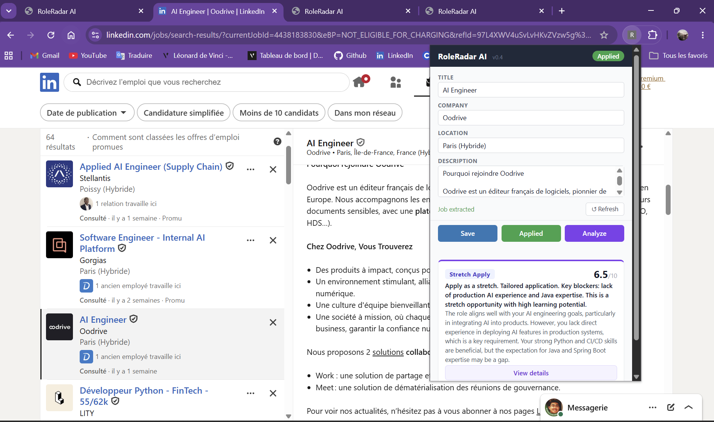
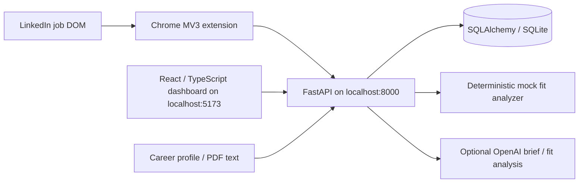

# RoleRadar AI

**Capture a LinkedIn job, keep its context, and decide whether it deserves an application.**

Job searches scatter postings, application status, and candidate notes across tabs and documents. RoleRadar AI brings them into a local workflow: a Chrome extension captures the posting, a dashboard tracks the pipeline, and optional AI analysis compares the role with a career profile and resume.

Completed **V1 portfolio project** for Forward Deployed Engineer, Applied AI, and AI Product Engineer roles. The repository demonstrates browser integration, API and persistence design, a React workflow, and context-aware model integration. It is a personal local tool; no public SaaS deployment or measured hiring outcomes are claimed.

## Demo

<video src="https://github.com/user-attachments/assets/d55da337-a264-4fe7-8bdd-2daa02fa4780" controls width="100%"></video>

[Watch/download the bundled demo](docs/videos/demo.mp4) if the embedded video does not render.

| Dashboard | Role-fit analysis | Chrome extension |
| --- | --- | --- |
|  |  |  |

These are preserved V1 recordings/screenshots. Their job counts and scores illustrate the interface, not usage metrics or evaluation results.

## Product workflow

1. Open a LinkedIn job and the extension. Review/edit extracted fields, expand the posting if needed, then save or mark it applied.
2. Track jobs across **Saved / Applied / Interview / Archived** with drag and drop, search, and notes. The API also supports OA, Offer, and Rejected statuses, grouped into the last two columns.
3. Edit a career profile and optionally upload a PDF with selectable text.
4. Run fit analysis explicitly. The default mock provider works without a key. Optional OpenAI calls produce a job brief and a profile-aware fit recommendation.

There is no auto-apply, form submission, scheduled scraping, or automated browsing. Opening the popup reads the current page and looks up an existing job; saving and analysis require user actions.

## Architecture


```mermaid
flowchart LR
    L[LinkedIn job DOM] --> E[Chrome MV3 extension]
    E --> A[FastAPI on localhost:8000]
    D[React / TypeScript dashboard on localhost:5173] --> A
    A --> S[(SQLAlchemy / SQLite)]
    P[Career profile / PDF text] --> A
    A --> M[Deterministic mock fit analyzer]
    A --> O[Optional OpenAI brief / fit analysis]
```

| Layer | Implementation |
| --- | --- |
| Capture | MV3, vanilla JavaScript, ordered DOM selectors and text fallbacks, extraction diagnostics |
| API / storage | FastAPI, Pydantic, SQLAlchemy, SQLite; jobs, one profile, analysis history |
| Dashboard | React, TypeScript, Vite, dnd-kit; optimistic status updates with error recovery |
| AI / resume | Keyword mock analyzer; optional OpenAI Chat Completions JSON mode; pypdf text extraction |

## Key engineering decisions

- **Visible-page capture:** multiple selector, heading, document-title, and text strategies accommodate LinkedIn layout variation. Diagnostics expose which strategy worked, description boundaries, and truncation warnings. This is heuristic extraction, with manual correction available.
- **Deduplication before insertion:** exact trimmed URL first, then normalized title + company. New jobs return `201`; duplicates return the existing record with `200`. This is an application-level check without a uniqueness constraint. The extracted LinkedIn ID is stored but is not used as a dedup key.
- **Mock-first workflow:** deterministic scoring makes the storage, profile, and dashboard workflow usable without model access. Mock output is marked in its explanation and does not represent validated role fit.
- **Local persistence:** SQLite keeps setup small. Startup creates tables and adds two missing columns for older databases; this is not a versioned migration system.

The [architecture guide](docs/architecture.md) explains API behavior, extraction debugging, persistence, and V1 trade-offs. The [interview guide](docs/interview-guide.md) preserves code/history evidence and talking points.

## AI design and data boundary

Brief generation and fit analysis are **separate, user-triggered requests**. A saved brief can enrich later analysis; generating a brief is not required to analyze a job.

The fit prompt asks the model to consider desirability, candidate fit, conversion likelihood, career upside, and opportunity cost. It returns one overall score/verdict plus rationale, risks, skill gaps, and preparation topics. The rubric and reference examples are prompt guidance, with no measured calibration or five separate dimension scores.

Both OpenAI paths use `response_format={"type": "json_object"}`, followed by JSON parsing and application response models. They do not use strict JSON Schema Structured Outputs or enforce scoring rules in code.

**Jobs, profile fields, and extracted resume text are stored locally by default. OpenAI fit analysis sends job description, notes, selected brief fields, selected profile fields, and full extracted resume text to OpenAI. Brief generation sends job title, company, location, and description.** Briefs always use OpenAI when a key is configured, even with `AI_PROVIDER=mock`. PDF upload itself parses locally and stores text, not the original PDF.

The [AI design guide](docs/ai-design.md) records exact inputs, prompts, output handling, and limitations. There is no measured per-job cost: charges depend on model pricing, input/output tokens, and whether both calls are made.

## Local setup

Use Python **3.10+**, Node.js **18+**, npm, and Chrome. `.python-version` records the original Python 3.11.14 environment; see the [verification record](docs/verification.md) for this cleanup's tested versions. Dependency installation needs package access; mock runtime and tests run offline afterward.

From the repository root:

```bash
python -m venv .venv
```

Activate it on macOS/Linux with `source .venv/bin/activate`, or in Windows PowerShell with `.\.venv\Scripts\Activate.ps1`. Then:

```bash
python -m pip install -r requirements.txt
npm ci
npm --prefix apps/dashboard ci
```

Copy `.env.example` to `.env`: `cp .env.example .env` on macOS/Linux or `Copy-Item .env.example .env` in PowerShell. Leave `AI_PROVIDER=mock` and the key empty for offline fit analysis. With the virtual environment active:

```bash
npm run dev
```

- Dashboard: http://localhost:5173
- API / interactive API docs: http://localhost:8000/docs
- Health: http://localhost:8000/health

If PowerShell blocks activation, run `.\.venv\Scripts\python.exe -m uvicorn backend.main:app --reload` in one terminal and `npm --prefix apps/dashboard run dev` in another. Keep ports 8000 and 5173 available; client URLs are hard-coded. Run the backend from the root so `.env` discovery and the relative SQLite path are consistent.

Load `extension/` with **Load unpacked** at `chrome://extensions` with Developer mode enabled. Open/reload a `linkedin.com/jobs/*` tab. Expand **Show more / Tout afficher**, inspect extracted fields, and save. Refresh the dashboard after capture.

For OpenAI fit analysis, set `AI_PROVIDER=openai`, `OPENAI_API_KEY`, and optionally `OPENAI_MODEL` (default `gpt-4o-mini`) in the root `.env`, then restart the backend. Never put the key in frontend or extension code.

Offline checks require Python **3.11+** for the unittest helpers, with the virtual environment active:

```bash
python -m pip install -r requirements-dev.txt
python -m compileall -q backend tests
python -m unittest discover -s tests -v
npm --prefix apps/dashboard run build
node --check extension/content.js
node --check extension/popup.js
git diff --check
```

For a walkthrough without LinkedIn, use the synthetic posting in [the verification guide](docs/verification.md).

## Limitations and status

V1 is complete for portfolio demonstration. Current limits are explicit:

- No authentication or multi-user isolation; wildcard development CORS and localhost client URLs. Keep it on loopback; public hosting needs a security/configuration redesign.
- LinkedIn DOM changes, broad fallbacks, truncation, and a 10,000-character capture cap can lose or misidentify content. No extraction reliability benchmark exists.
- Dedup can merge distinct roles sharing title/company and can race during concurrent saves. URLs are not canonicalized.
- AI scores are unvalidated suggestions. Output validation, model provenance, prompt evaluations, input limits, and stale-analysis detection are incomplete. Contract/location preferences and decision style are saved but currently omitted from the fit prompt.
- PDF parsing has no OCR or upload size limit. Python dependencies use lower bounds rather than a reproducible lock.

Potential work beyond V1 is documented as proposals in the secondary guides; it is not part of the implemented feature set.
